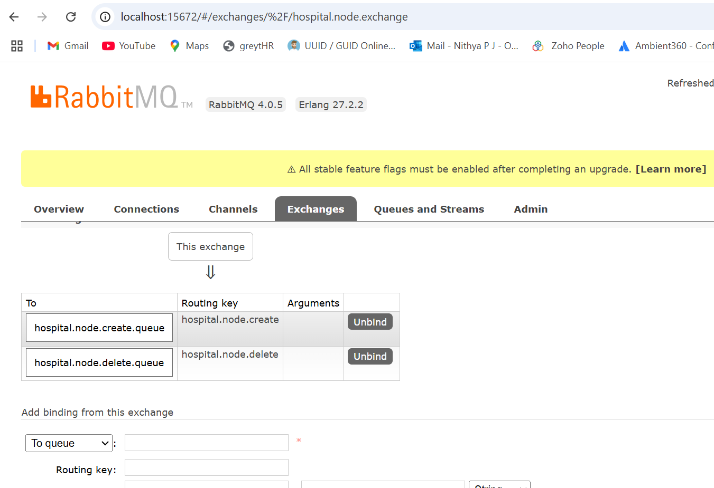

# Hospital Management using rabbitMQ

## Overview

This project is a Spring Boot application that manages hospital nodes with creation and deletion operations. It uses:

H2 in-memory database for storing hospital nodes.

RabbitMQ for messaging between producer and consumer.

On creation and deletion of a hospital node, a message is sent to RabbitMQ, and the consumer processes the message accordingly.

## Prerequisites

Ensure you have the following installed:

* Java 17+ (Recommended: OpenJDK 17)
* Maven 3.6+
* RabbitMQ
* Postman or any API testing tool

## Installations

### RabbitMQ
1. Download and install Erlang https://www.erlang.org/downloads
2. Download installer from: https://www.rabbitmq.com/download.html
3. Run the installer and follow the installation steps.
4. Start rabbitmq:  
   `rabbitmq-service start`
5. Open http://localhost:15672 to verify. Use guest/guest (username/password) to login.

## Configurations

### H2 database
spring.datasource.url=jdbc:h2:mem:hospital  
spring.datasource.driverClassName=org.h2.Driver  
spring.datasource.username=sa  
spring.datasource.password=  
spring.datasource.platform=h2  
spring.h2.console.enabled=true  
spring.h2.console.path=/h2-console  
  
spring.jpa.hibernate.ddl-auto=update  

### RabbitMQ
spring.rabbitmq.host=localhost  
spring.rabbitmq.port=5672  
spring.rabbitmq.username=guest  
spring.rabbitmq.password=guest  

## Instructions to run

1. Start the hospital-management application:  
   `spring-boot:run`
2. cURL to create a new hospital node:  
   `curl --location 'http://localhost:8080/v1/hospital-management/node' \
   --header 'Content-Type: application/json' \
   --data '{
   "name": "City Hospital",
   "type": "Hospital"
   }'`
3. cURL to delete an existing hospital node:  
   `curl --location --request DELETE 'http://localhost:8080/v1/hospital-management/node/id/3'`
4. NodeMessageProducer send message to the exchange and NodeMessageConsumer has two listeners each listening to CREATE and DELETE operations.
5. Verify RabbitMQ console to ensure all queues and exchanges are created as expected  

## Future Enhancements
1. Security
2. Validations of hierarchy while adding a new hospital node
3. Manual acknowledgments and requeueing if required.
# rabbitMQ-poc
